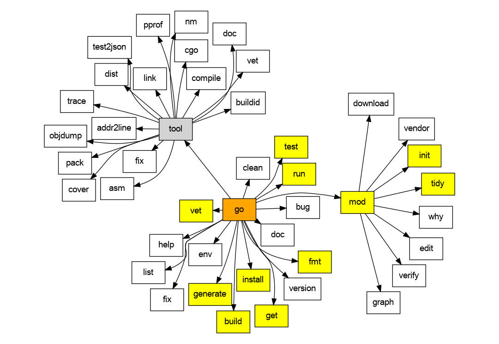
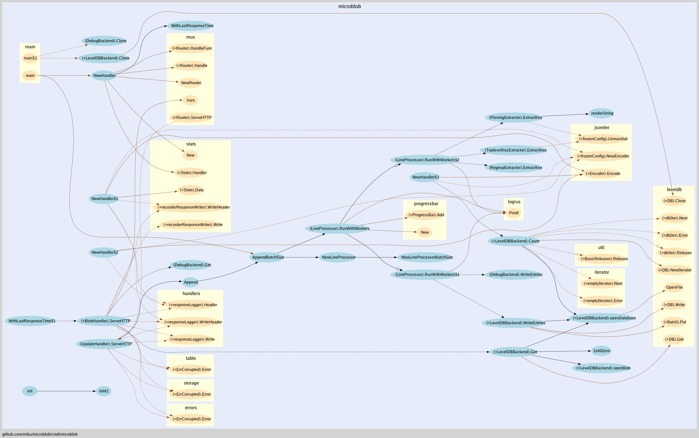

# Intro

> Go is an [open source](https://golang.org/LICENSE) programming language that makes it easy to build simple,
> reliable, and efficient software. --
> [https://golang.org/](https://golang.org/)

## Spec

* [ref/spec](https://golang.org/ref/spec)

## Development

* [golang/go](https://github.com/golang/go/)
* [Proposals](https://github.com/golang/proposal), language evolution

## Compatibility Statement

* [Go 1 and the Future of Go Programs](https://golang.org/doc/go1compat) (2012 or earlier)

> It is intended that programs written to the Go 1 specification will continue
> to compile and run correctly, unchanged, over the lifetime of that
> specification.

Some exceptions, e.g. OS specific code, like [syscall](https://golang.org/pkg/syscall/).

## Other Resources


* [more Go books](https://www.google.com/search?channel=fs&client=ubuntu&q=golang+books)


## Hello, World

[embedmd]:# (x/hello/main.go)
```go
package main

import "fmt"

func main() {
	fmt.Println("hello, world")
}
```

Save code into a file, e.g. `main.go` - then:

```
$ go run main.go
```

## Execution Model

* Go is a compiled, strongly typed, garbage-collected language. An executable
  lives in a *package main* and contains a function *main* as entry point.

## Where does Go code live?

All Go code is organized in packages.

> Go code is organized into packages. Within a package, code can refer to any
> identifier (name) defined within, while clients of the package may only
> reference the package's exported types, functions, constants, and variables

## What is a package?

> A package in Go is simply a directory/folder with one or more .go files inside
> of it. -- [https://rakyll.org/style-packages/](https://rakyll.org/style-packages/)


## Import resolution

At import time, Go first look for packages in `$GOROOT/src`, which contains the
standard library (see Extra: Stdlib packages).

Depending on the project setup, e.g. GOPATH (early) or module-aware (current)
code will be searched in GOPATH or the module cache.

## Getting Go packages

There is no extra package manager - the go tool is used to install packages:

```
$ go install golang.org/x/tools/cmd/goimports@latest
```

> [Go] get resolves its command-line arguments to packages at specific module
versions, updates go.mod to require those versions, downloads source code into
the module cache, then builds and installs the named packages.

You see `go install` a lot in READMEs. Caveat: as of 1.17 [Using go get for
installing executables
deprecated](https://golang.org/doc/go-get-install-deprecation).

These frictions come from mixed use cases with `go get` to fetch and build code
- and with the introduction of go modules, to also change the `go.mod` file
describing dependencies.

Go modules are the preferred way to start applications and libraries today.

To install executables on your system, run `go install` instead:

* without version suffix, if works on module level
* with version suffix (e.g. "@latest") it ignores modules

```
$ go install golang.org/x/tools/cmd/goimports@latest
```

## Why Go?

### What is so great?

[Stack Overflow: What’s so great about Go?](https://stackoverflow.blog/2020/11/02/go-golang-learn-fast-programming-languages/)

* can be used for common problems (that e.g. scripting languages solve)
* can be used for performance critical code (as far as GC languages can be used)
* kind of resonates with software engineering today
* simple (kind-of)
* fast

> In a regex test -
> [regex-redux](https://benchmarksgame-team.pages.debian.net/benchmarksgame/description/regexredux.html#regexredux)
> - Go ran in 3.55 seconds while Java ran in 5.58. The Go program weighed in at
> 102 lines of code, while the Java program weighed in at 70. True, Go was a
> little heftier than Java, but given the speed at which Go bested the next most
> popular system language, it’s clear you’re not sacrificing speed. -- []()

### Performance

Go is garbage-collected, yet fast - or fast enough for many use cases.

Anecdotal evidence: A simple, unoptimized reservoir sampling tool in Go is about
twice as slow than a classic (most likely optimized) C tool.

-- [miku/rsampling](https://github.com/miku/rsampling),

### Not a research language

> In short, development at Google is big, can be slow, and is often clumsy. But
> it is effective.

> The goals of the Go project were to eliminate the slowness and clumsiness of
software development at Google, and thereby to make the process more productive
and scalable. The language was designed by and for people who write—and read and
debug and maintain—large software systems.

> Go's purpose is therefore not to do research into programming language design;
> it is to improve the working environment for its designers and their
> coworkers. Go is more about software engineering than programming language
> research. Or to rephrase, it is about language design in the service of
> software engineering.

-- [https://talks.golang.org/2012/splash.article](https://talks.golang.org/2012/splash.article)


## Extra: Stdlib packages

```
$ tree -d -I 'vendor|testdata|internal' /usr/local/go/src/
/usr/local/go/src/
├── archive
│   ├── tar
│   └── zip
├── bufio
├── builtin
├── bytes
├── cmd
│   ├── addr2line
│   ├── api
│   ├── asm
│   ├── buildid
│   ├── cgo
│   ├── compile
│   ├── cover
│   ├── dist
│   ├── doc
│   ├── fix
│   ├── go
│   ├── gofmt
│   ├── link
│   ├── nm
│   ├── objdump
│   ├── pack
│   ├── pprof
│   ├── test2json
│   ├── trace
│   └── vet
├── compress
│   ├── bzip2
│   ├── flate
│   ├── gzip
│   ├── lzw
│   └── zlib
├── container
│   ├── heap
│   ├── list
│   └── ring
├── context
├── crypto
│   ├── aes
│   ├── cipher
│   ├── des
│   ├── dsa
│   ├── ecdsa
│   ├── ed25519
│   ├── elliptic
│   ├── hmac
│   ├── md5
│   ├── rand
│   ├── rc4
│   ├── rsa
│   ├── sha1
│   ├── sha256
│   ├── sha512
│   ├── subtle
│   ├── tls
│   └── x509
│       └── pkix
├── database
│   └── sql
│       └── driver
├── debug
│   ├── dwarf
│   ├── elf
│   ├── gosym
│   ├── macho
│   ├── pe
│   └── plan9obj
├── embed
├── encoding
│   ├── ascii85
│   ├── asn1
│   ├── base32
│   ├── base64
│   ├── binary
│   ├── csv
│   ├── gob
│   ├── hex
│   ├── json
│   ├── pem
│   └── xml
├── errors
├── expvar
├── flag
├── fmt
├── go
│   ├── ast
│   ├── build
│   │   └── constraint
│   ├── constant
│   ├── doc
│   ├── format
│   ├── importer
│   ├── parser
│   ├── printer
│   ├── scanner
│   ├── token
│   └── types
│       └── fixedbugs
├── hash
│   ├── adler32
│   ├── crc32
│   ├── crc64
│   ├── fnv
│   └── maphash
├── html
│   └── template
├── image
│   ├── color
│   │   └── palette
│   ├── draw
│   ├── gif
│   ├── jpeg
│   └── png
├── index
│   └── suffixarray
├── io
│   ├── fs
│   └── ioutil
├── log
│   └── syslog
├── math
│   ├── big
│   ├── bits
│   ├── cmplx
│   └── rand
├── mime
│   ├── multipart
│   └── quotedprintable
├── net
│   ├── http
│   │   ├── cgi
│   │   ├── cookiejar
│   │   ├── fcgi
│   │   ├── httptest
│   │   ├── httptrace
│   │   ├── httputil
│   │   └── pprof
│   ├── mail
│   ├── rpc
│   │   └── jsonrpc
│   ├── smtp
│   ├── textproto
│   └── url
├── os
│   ├── exec
│   ├── signal
│   └── user
├── path
│   └── filepath
├── plugin
├── reflect
├── regexp
│   └── syntax
├── runtime
│   ├── cgo
│   ├── debug
│   ├── metrics
│   ├── msan
│   ├── pprof
│   ├── race
│   └── trace
├── sort
├── strconv
├── strings
├── sync
│   └── atomic
├── syscall
│   └── js
├── testing
│   ├── fstest
│   ├── iotest
│   └── quick
├── text
│   ├── scanner
│   ├── tabwriter
│   └── template
│       └── parse
├── time
│   └── tzdata
├── unicode
│   ├── utf16
│   └── utf8
└── unsafe

184 directories

```

## Extra: Go Tool, editors and helpers

### Go Tool Overview

The go tool covers many aspects of code life cycle, e.g. formatting, running, building, testing, linting code, etc. 




### Editors and helpers

There is an [editor support page](https://golang.org/doc/editors.html), the wiki contains a more comprehensive list:

* [IDEs and Plugins for Go](https://github.com/golang/go/wiki/IDEsAndTextEditorPlugins)

For a good cross-platform experience, the [Visual Studio
Code](https://code.visualstudio.com/) and
[vscode-go](https://github.com/Microsoft/vscode-go) (6M+ downloads
currently).

Depending on your setup, I can recommend [vim-go](https://github.com/fatih/vim-go).

A huge project currently in development is
[gopls](https://github.com/golang/tools/blob/master/gopls/README.md), the

> official Go language server developed by the Go team


### goimports

Mostly integrated into editor support: run `go fmt` and sorts out imports.

Install with:

```
$ go install golang.org/x/tools/cmd/goimports@latest
```

Note: Also `go get` works, but `install` is now recommended:
[https://golang.org/ref/mod#go-get](https://golang.org/ref/mod#go-get)

### Quick Help

Run `go doc` to get quick access to documentation.

```
usage: go doc [-u] [-c] [package|[package.]symbol[.methodOrField]]
```

Package docs:

```
$ go doc http
```

Specific symbol:

```
$ go doc http.RoundTripper
```

Current project.

```
$ go doc .
```

You'll need to run this in a directory with Go files, otherwise you might see a:

```
doc: no buildable Go source files in
```

By default, `go doc` will show an overview. To see all documentation for a package:

```
$ go doc -all leveldb # inside a module
$ go doc -all ./skate # outside go mod
```

Or refering to the full package name:

```
$ go doc -all github.com/syndtr/goleveldb/leveldb
```

Show full source:

```
$ go doc -src io.ReadCloser
package io // import "io"

// ReadCloser is the interface that groups the basic Read and Close methods.
type ReadCloser interface {
        Reader
        Closer
}

func NopCloser(r Reader) ReadCloser
```

The `go doc` tool does not come with `...` support.

> The package path must be either a qualified path or a proper suffix of a path.
The go tool's usual package mechanism does not apply: package path elements like
. and ... are not implemented by go doc.


### Navigation

For exploring a larger codebase:

* Jump back and forth to definitions (e.g. `CTRL-g d`, "Go to definition", ...)
* A call graph visualizer


### Call graphs

Install [go-callvis](https://github.com/ofabry/go-callvis), then clone a repo you want to analyze:

```
$ go-callvis -file callgraph -format png -nostd \
    -focus github.com/miku/microblob \
    github.com/miku/microblob/cmd/microblob
```




## Selected notes on ref/spec

A few picks from [ref/spec](https://golang.org/ref/spec).

### Semicolons

Even if you do not see them typically, Go uses
  [semicolons](https://golang.org/ref/spec#Semicolons) - they just get
  automatically inserted into the token stream.

### Identifiers

You can name a variable `αβ` - *first character in an identifier must be a letter*.

> Go treats all characters in any of the Letter categories Lu, Ll, Lt, Lm, or Lo as Unicode letters [...]

* [Unicode 4.5 General Category](https://www.unicode.org/versions/Unicode8.0.0/ch04.pdf#page=17)


### Rune literals

A rune is an alias for int32, representing a Unicode code point.

It is written with single quotes.

> A rune literal is expressed as one or more characters enclosed in single quotes, as in 'x' or '\n'.

[embedmd]:# (x/runevalue/main.go)
```go
package main

import "fmt"

func main() {
	a := 'a'
	fmt.Printf("%T %c %d %x %v\n", a, a, a, a, a == 97)
	fmt.Printf("%s %d\n", "a", len("a"))

	v := '⧉'
	fmt.Printf("%T %c %d %x %v\n", v, v, v, v, v == 10697)

	// int32 a 97 61 true
	// int32 ⧉ 10697 29c9 true
}
```

More on format verbs: [https://pkg.go.dev/fmt#hdr-Printing](https://pkg.go.dev/fmt#hdr-Printing)

More on that in [https://blog.golang.org/strings](https://blog.golang.org/strings).
